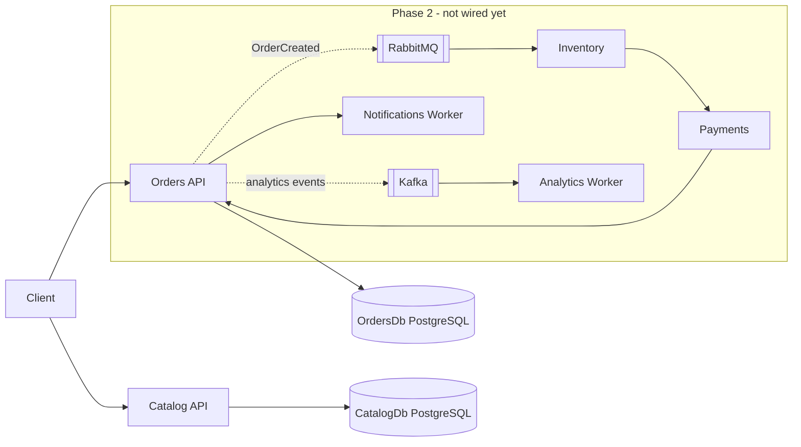
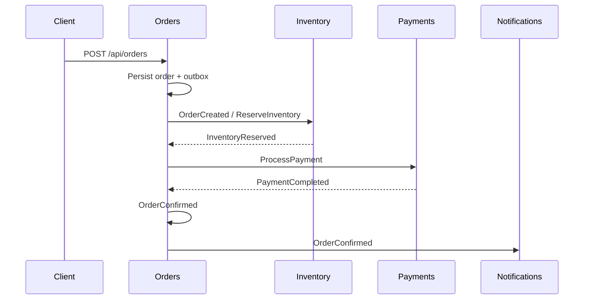

# FoodFlow

A production-minded event-driven restaurant platform built with .NET microservices, PostgreSQL, RabbitMQ, Kafka, Docker, and OpenTelemetry.

This repository is a Foodics-style backend assignment. It is **not** a toy CRUD app and **not** a production deployment. The design is production-minded; the running demo is a local system you can explain line by line.

## Why This Project Exists

Foodics platforms coordinate restaurant operations: menus, stock, orders, payments, and notifications. Those concerns fail independently. A payment provider timeout must not lock catalog reads. An inventory consumer crash must not lose the fact that an order was placed.

FoodFlow therefore uses:

- **microservices** with a **database per service**
- **commands and events** instead of shared-database joins
- **RabbitMQ** for operational work
- **Kafka** for analytics streams
- **outbox + inbox** so crashes do not create silent dual-writes or duplicate money/stock side effects

## Current Delivery Phase

**Phase 1 — Foundation and service architecture** is implemented.

Phase 1 includes the solution, service boundaries, Orders and Catalog HTTP/persistence slices, PostgreSQL, health endpoints, OpenAPI, domain tests, and documentation.

Phase 1 does **not** include RabbitMQ, Kafka, MassTransit, outbox, inbox, sagas, or the full Docker topology. Those start in Phase 2 after an explicit go-ahead.

## Architecture



Planned operational workflow (Phase 2):



## Services

| Service | Phase 1 status | Owns | Responsibility |
| --- | --- | --- | --- |
| Orders | HTTP + PostgreSQL | OrdersDb | Create/retrieve orders, lifecycle, totals |
| Catalog | HTTP + PostgreSQL | CatalogDb | Products, categories, prices, availability |
| Inventory | Host skeleton | InventoryDb in Phase 2 | Reservations and stock |
| Payments | Host skeleton | PaymentsDb in Phase 2 | Fake payment processing |
| Notifications | Worker skeleton | none | Simulated email/SMS/push from events |
| Analytics | Worker skeleton | none | Kafka consumer / projections in Phase 2 |

A service never reads another service's database. Orders stores a product name/price **snapshot** on each line. That is intentional: checkout must not depend on a synchronous Catalog call in this design.

## Event-Driven Workflow

Not running in Phase 1. The integration contracts already live in `FoodFlow.Contracts` so Phase 2 can publish records instead of EF entities.

## RabbitMQ

Planned for **operational** messaging: reserve inventory, process payment, confirm/cancel, notify. MassTransit will sit on top of AMQP. Not implemented yet.

## Kafka

Planned for **analytics streaming**: retain and replay business facts such as order and payment events. Not implemented yet.

## Why RabbitMQ AND Kafka?

They overlap, so this project does not pretend they are opposites. RabbitMQ is a better default for work queues, competing consumers, and command/event routing with retry/dead-letter. Kafka is a better default when many independent consumers need an ordered, replayable log. Phase 2 will use each for a different job, not the same job twice.

## PostgreSQL / Database-per-Service

Phase 1 runs two PostgreSQL databases: `orders` and `catalog`. That is logical isolation. Production can place those databases on separate instances without changing service code.

See [docs/adr/001-database-per-service.md](docs/adr/001-database-per-service.md) and [docs/adr/002-postgresql.md](docs/adr/002-postgresql.md).

## Transactional Outbox

Phase 2. Dual-write (commit to SQL, then publish to a broker) is unsafe. Outbox stores the message in the same local transaction as the business row.

## Idempotency

Phase 2. Brokers give at-least-once delivery. Inbox/processed-message rows prevent double reservation and double payment.

## Retry & Error Handling

Phase 2. Retry transient failures only. Exhausted messages must land in an inspectable error/dead-letter queue.

## Saga / Compensation

Phase 2. If inventory is reserved and payment fails, release inventory and cancel the order. No distributed SQL transaction.

## Docker

Phase 1 Compose starts only the two PostgreSQL instances:

```bash
docker compose up -d
```

Application images, RabbitMQ, Kafka, and observability land in later phases.

## Observability

Phase 1 has structured JSON logs, `X-Correlation-Id`, and liveness/readiness. OpenTelemetry traces, metrics, and Aspire Dashboard are Phase 3.

## OpenTelemetry

Phase 3.

## Testing

Domain tests cover order totals, invalid orders, cancellation rules, and catalog price/availability invariants:

```bash
export DOTNET_ROOT="$HOME/.dotnet"   # if the SDK was installed with the user-local script
export PATH="$DOTNET_ROOT:$PATH"
dotnet test
```

## Running Locally

Requirements: .NET 10 SDK, and either Docker Engine or the user-local PostgreSQL script in `scripts/`.

```bash
# 1. Databases
docker compose up -d
# or, if Docker is not installed:
chmod +x scripts/*.sh
./scripts/start-local-postgres.sh

# 2. Run APIs
dotnet run --project src/Services/Orders/FoodFlow.Orders.Api
dotnet run --project src/Services/Catalog/FoodFlow.Catalog.Api
```

Development applies EF migrations on startup. Connection strings in `appsettings.Development.json` are **local defaults**, not production secrets.

| Service | URL |
| --- | --- |
| Orders | http://localhost:5101 |
| Catalog | http://localhost:5102 |
| Inventory skeleton | http://localhost:5103 |
| Payments skeleton | http://localhost:5104 |

## Example API Calls

```bash
curl -s http://localhost:5101/health/live
curl -s http://localhost:5101/health/ready
curl -s http://localhost:5102/health/ready
curl -s http://localhost:5101/openapi/v1.json | head

curl -sS -X POST http://localhost:5102/api/products \
  -H 'Content-Type: application/json' \
  -H 'X-Correlation-Id: demo-001' \
  -d '{"name":"Chicken Kabsa","category":"mains","price":32.50,"currency":"SAR","isAvailable":true}'

curl -sS -X POST http://localhost:5101/api/orders \
  -H 'Content-Type: application/json' \
  -H 'X-Correlation-Id: demo-001' \
  -d '{
        "restaurantId":"aaaaaaaa-aaaa-aaaa-aaaa-aaaaaaaaaaaa",
        "customerId":"bbbbbbbb-bbbb-bbbb-bbbb-bbbbbbbbbbbb",
        "currency":"SAR",
        "items":[{"productId":"cccccccc-cccc-cccc-cccc-cccccccccccc","productName":"Chicken Kabsa","quantity":2,"unitPrice":32.50}]
      }'
```

## Failure Scenarios

Phase 1 demonstrates HTTP validation and domain rejection (empty order, invalid currency, missing resource). Broker, payment, and stock failures are Phase 2.

## Architecture Decisions

- [ADR 001 — Database per service](docs/adr/001-database-per-service.md)
- [ADR 002 — PostgreSQL](docs/adr/002-postgresql.md)
- [Architecture notes](docs/architecture.md)

## Production Considerations

This is a demo of production *patterns*, not a production *deployment*. Missing for production: authn/authz, secret management, dedicated migrate jobs, broker HA, backup/PITR, autoscaling, and real payment/SMS providers.

## Trade-offs

Clean Architecture layers exist where they earn their keep (Orders/Catalog). Inventory, Payments, Notifications, and Analytics are honest skeletons rather than empty enterprise folders. There is no MediatR, no generic repository, and no Unit of Work wrapper over `DbContext`.

## Future Improvements

Phase 2: messaging, outbox, inbox, saga compensation, Kafka analytics, full Compose.  
Phase 3: OpenTelemetry, richer tests, GitHub Actions hardening, interview guide.

## Three-phase roadmap

1. **Phase 1** — foundation, Orders/Catalog, PostgreSQL, tests, docs.
2. **Phase 2** — event-driven order processing with RabbitMQ + Kafka.
3. **Phase 3** — observability, quality, and delivery automation.
