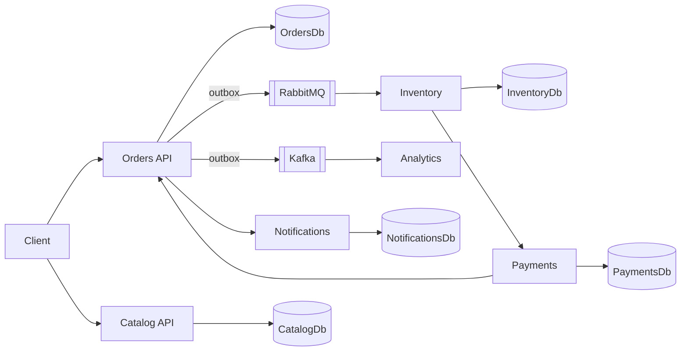

# FoodFlow

A production-minded event-driven restaurant platform built with .NET microservices, PostgreSQL, RabbitMQ, Kafka, Docker, and OpenTelemetry.

This repository is a Foodics-style backend assignment. It is **not** a toy CRUD app and **not** a production deployment. The design is production-minded; the running demo is a local system you can explain line by line.

## Why This Project Exists

Foodics platforms coordinate restaurant operations: menus, stock, orders, payments, and notifications. Those concerns fail independently. A payment provider timeout must not lock catalog reads. An inventory consumer crash must not lose the fact that an order was placed.

FoodFlow therefore uses:

- **microservices** with a **database per service**
- **commands and events** instead of shared-database joins
- **RabbitMQ** for operational work
- **Kafka** for analytics streams
- **outbox + inbox** so crashes do not create silent dual-writes or duplicate money/stock side effects

## Current Delivery Phase

**Phase 2 — Event-driven order processing** is implemented.

Phase 1 established service boundaries, Orders/Catalog HTTP and persistence, PostgreSQL, health, OpenAPI, and domain tests.

Phase 2 adds RabbitMQ, MassTransit, Kafka, transactional outbox, inbox idempotency, retries, dead-letter, choreographed compensation, Notifications, Analytics, Docker Compose for the brokers, and integration tests.

Phase 3 (OpenTelemetry dashboards) is **not** started.

The interview walkthrough is [docs/phase-2-event-driven.md](docs/phase-2-event-driven.md).

## Architecture



## Services

| Service | Owns | Responsibility |
| --- | --- | --- |
| Orders | OrdersDb | Create orders, confirm/cancel from payment and inventory facts |
| Catalog | CatalogDb | Products, prices, availability (HTTP; snapshots on order lines) |
| Inventory | InventoryDb | Stock, reserve, release, oversell protection |
| Payments | PaymentsDb | Fake provider: complete or decline, one charge per order |
| Notifications | NotificationsDb | Simulated email/SMS from order/payment events |
| Analytics | Kafka consumer group | Order/payment/inventory failure projections |

A service never reads another service's database.

## Event-Driven Workflow

Choreography with explicit commands:

1. `POST /api/orders` persists the order and outbox (`OrderCreated` + `ReserveInventory`).
2. Inventory reserves or publishes `InventoryReservationFailed`.
3. On success Inventory sends `ProcessPayment`.
4. Payments publishes `PaymentCompleted` or `PaymentFailed`.
5. Orders confirms or cancels. Payment failure also sends `ReleaseInventory`.
6. Notifications consume `OrderConfirmed` / `OrderCancelled`.
7. Analytics consumes selected facts from Kafka.

## RabbitMQ

Operational backbone. MassTransit, durable queues, publisher confirms, ack after the consumer transaction, three short retries for transient faults, `{queue}_error` after exhaustion or `PermanentMessagingException`.

## Kafka

Analytics backbone. Topics `foodflow.orders` and `foodflow.payments`. Keys are order ids. Group `foodflow-analytics`. Retention is configured on the broker. Analytics lag does not block checkout.

## Why RabbitMQ AND Kafka?

They overlap, so this project does not pretend they are opposites. RabbitMQ is a better default for work queues, competing consumers, and command/event routing with retry/dead-letter. Kafka is a better default when many independent consumers need an ordered, replayable log. Each is used for a different job, not the same job twice.

## PostgreSQL / Database-per-Service

Orders, Catalog, Inventory, Payments, and Notifications each have a database. See [docs/adr/001-database-per-service.md](docs/adr/001-database-per-service.md).

## Transactional Outbox

Each write that must be messaged inserts `outbox_messages` in the same `SaveChanges` as the aggregate. A background publisher then talks to RabbitMQ and, for analytics facts, Kafka.

## Idempotency

`inbox_messages` plus unique business keys (reservation `OrderId`, payment `OrderId`, stock version) so at-least-once delivery cannot double-reserve or double-charge.

## Retry & Error Handling

Retry infrastructure blips. Do not retry a declined card or empty stock as if the broker glitched. Poison messages (`44444444-...` product) land in MassTransit `_error`.

## Saga / Compensation

Lightweight choreography. If inventory is reserved and payment fails, `ReleaseInventory` then `OrderCancelled`. No distributed SQL transaction.

## Docker

```bash
docker compose up --build -d
docker compose ps
```

Infrastructure: PostgreSQL × 5, RabbitMQ, Kafka (KRaft, no ZooKeeper). Applications are also in Compose.

## Observability

Structured JSON logs, `X-Correlation-Id`, liveness/readiness. Grafana/Prometheus/OpenTelemetry exporters are Phase 3.

## Testing

```bash
export DOTNET_ROOT="$HOME/.dotnet"
export PATH="$DOTNET_ROOT:$PATH"
dotnet test
```

Domain tests are in-process. Integration tests use Testcontainers (real PostgreSQL, RabbitMQ, Kafka) and cover happy path, inventory failure, payment compensation, duplicates, transient retry, dead-letter, Kafka analytics, and inventory restart.

## Running Locally

Requirements: .NET 10 SDK and Docker.

```bash
docker compose up --build -d
```

Development connection strings in `appsettings.Development.json` target mapped Compose ports.

| Service | URL |
| --- | --- |
| Orders | http://localhost:5101 |
| Catalog | http://localhost:5102 |
| Inventory | http://localhost:5103 |
| Payments | http://localhost:5104 |
| Notifications | http://localhost:5105 |
| Analytics | http://localhost:5106 |
| RabbitMQ UI | http://localhost:15672 (foodflow / foodflow) |

## Example API Calls

Happy path (in-stock product `cccccccc-...`, customer `bbbbbbbb-...`):

```bash
curl -sS -X POST http://localhost:5101/api/orders \
  -H 'Content-Type: application/json' \
  -H 'X-Correlation-Id: demo-001' \
  -d '{
        "restaurantId":"aaaaaaaa-aaaa-aaaa-aaaa-aaaaaaaaaaaa",
        "customerId":"bbbbbbbb-bbbb-bbbb-bbbb-bbbbbbbbbbbb",
        "currency":"SAR",
        "items":[{"productId":"cccccccc-cccc-cccc-cccc-cccccccccccc","productName":"Chicken Kabsa","quantity":1,"unitPrice":32.50}]
      }'
```

Inventory failure: product `11111111-1111-1111-1111-111111111111`.  
Payment failure: customer `22222222-2222-2222-2222-222222222222`.

Then poll `GET /api/orders/{id}`, `GET /api/payments/by-order/{id}`, `GET /api/notifications/by-order/{id}`, `GET /api/analytics/snapshot`.

## Architecture Decisions

- [ADR 001 — Database per service](docs/adr/001-database-per-service.md)
- [ADR 002 — PostgreSQL](docs/adr/002-postgresql.md)
- [ADR 003 — RabbitMQ and Kafka](docs/adr/003-rabbitmq-and-kafka.md)
- [Architecture notes](docs/architecture.md)
- [Phase 2 interview guide](docs/phase-2-event-driven.md)

## Production Considerations

This is a demo of production *patterns*, not a production *deployment*. Missing for production: authn/authz, secret management, dedicated migrate jobs, broker HA, backup/PITR, autoscaling, and real payment/SMS providers.

## Trade-offs

No MediatR, no generic repository, no Unit of Work wrapper over `DbContext`. The outbox poller is explicit rather than MassTransit EF outbox so Kafka and RabbitMQ share one table. Analytics state is an in-memory projection fed by Kafka; replay is the source of truth.

## Future Improvements

Phase 3: OpenTelemetry, richer tests, GitHub Actions hardening, interview guide.

## Three-phase roadmap

1. **Phase 1** — foundation, Orders/Catalog, PostgreSQL, tests, docs.
2. **Phase 2** — event-driven order processing with RabbitMQ + Kafka.
3. **Phase 3** — observability, quality, and delivery automation.
