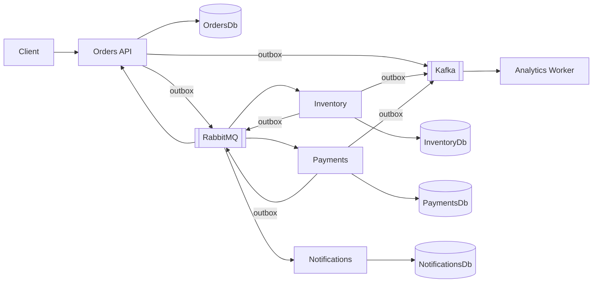
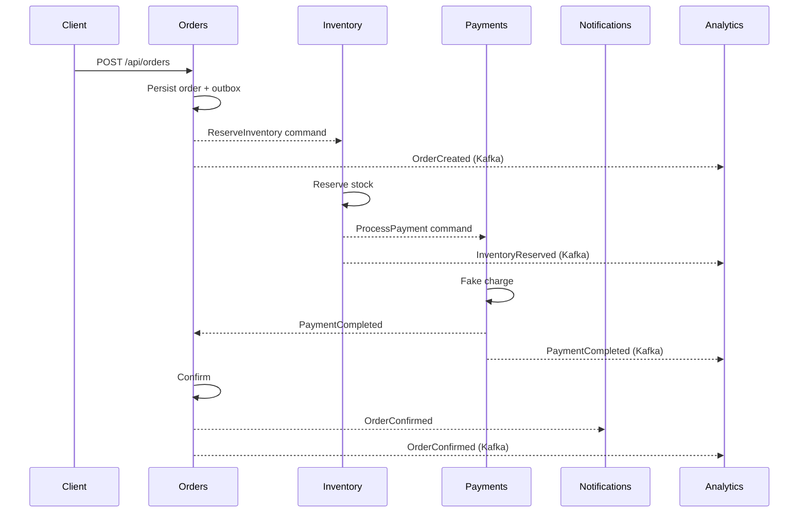
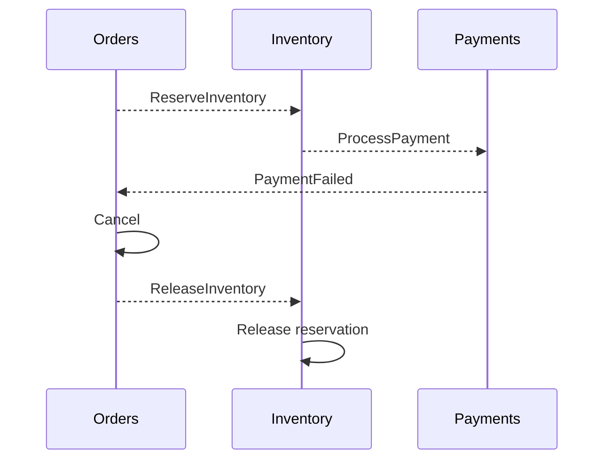

# Phase 2 — Event-driven order processing

This is the interview-ready note for the FoodFlow choreography. Phase 1 boundaries stay in place: database-per-service, product snapshots on order lines, no distributed SQL transaction.

## 1. Architecture



Operational path: HTTP write → local PostgreSQL transaction (aggregate + outbox) → outbox publisher → RabbitMQ → consumer (inbox + aggregate + outbox).

Analytics path: the same local transaction may also insert a Kafka outbox row for selected facts. Analytics is a consumer group on those topics. It does not reserve stock or charge cards.

## 2. Why RabbitMQ?

Checkout is **work**. Work needs competing consumers, per-message ack, retry with isolation from permanent business failures, and an inspectable error queue. RabbitMQ (via MassTransit) is the default tool for that shape.

Publisher confirms are used by MassTransit RabbitMQ. Queues are durable. Prefetch is bounded.

## 3. Why Kafka?

Analytics needs a **log**: retain, replay, consume independently, and keep order-id ordering on a partition. Kafka is the default tool for that shape.

FoodFlow does not put `ReserveInventory` or `ProcessPayment` on Kafka. Those are commands. Commands are not a replayable marketing fact.

## 4. Commands vs events

| Kind | Meaning | Examples |
| --- | --- | --- |
| Command | Please do this | `ReserveInventory`, `ReleaseInventory`, `ProcessPayment` |
| Event | This already happened | `OrderCreated`, `InventoryReserved`, `InventoryReservationFailed`, `PaymentCompleted`, `PaymentFailed`, `OrderConfirmed`, `OrderCancelled`, `InventoryReleased` |

Contracts are immutable records in `FoodFlow.Contracts`. They carry `EventId`, `CorrelationId`, and `OccurredAtUtc`. They are not EF entities.

## 5. Happy-path workflow



Demo identifiers live in `DemoScenarios` (in-stock product, out-of-stock product, payment-fail customer, transient/permanent poison product ids).

## 6. Failure workflow

**Inventory cannot reserve** (out of stock, unknown product): Inventory publishes `InventoryReservationFailed`. Orders cancels. No payment. Compensation is not required because stock did not move.

**Payment declines** (customer `22222222-...`): Payments publishes `PaymentFailed`. Orders cancels and sends `ReleaseInventory`. Inventory releases the reservation and publishes `InventoryReleased`. That is compensation.



There is no two-phase commit across OrdersDb, InventoryDb, and PaymentsDb.

## 7. Transactional outbox

Dual-write is: `SaveChanges()` then `bus.Publish()`. A crash between those lines creates a silent missing message, or a published message without a committed row.

FoodFlow writes the aggregate and `outbox_messages` in **one PostgreSQL transaction**. `OutboxProcessor<TContext>` polls unpublished rows and publishes to RabbitMQ or Kafka, then marks `PublishedAtUtc`.

This is a real table in each service database, not an in-memory list. MassTransit's EF outbox was not used because the same processor must also emit Kafka records; one explicit poller is easier to explain.

If the broker is down, the row stays unpublished and is retried until `MaxAttempts`.

## 8. Idempotency

Brokers are at-least-once. Each consumer claims `(consumer, messageId)` in `inbox_messages` in the same transaction as the business write. A duplicate `EventId` is a no-op.

Payments also has a unique index on `OrderId`. Inventory reservations are keyed by `OrderId`. Stock uses a concurrency token so two reservations cannot oversell the last unit.

Crash after commit and before ack: the message is redelivered, the inbox claim already exists, the side effect does not run twice.

## 9. Retry and error handling

MassTransit retries transient exceptions three times with short backoff. `PermanentMessagingException` is ignored by the retry policy and goes to `{queue}_error` (MassTransit dead-letter).

Demo:

- Product `33333333-...` throws `TransientMessagingException` twice, then succeeds.
- Product `44444444-...` throws `PermanentMessagingException` immediately.

Business declines (insufficient stock, fake card decline) are **events**, not exceptions. They must not bounce around a retry loop.

## 10. Compensation / Saga

This workflow is **choreography**: each service reacts to messages. There is no MassTransit saga state machine.

A **saga** here means a long-running business transaction with a compensation path, not a distributed SQL transaction.

**Orchestration** would put a central coordinator (Orders or a saga service) that sends every command. **Choreography** lets Inventory emit `ProcessPayment` after a successful reserve. FoodFlow is choreography with explicit commands between steps.

**Eventual consistency**: a GET between `InventoryReserved` and `OrderConfirmed` can show `Created`. That is expected. Clients poll or subscribe; they do not expect a single ACID commit across services.

## 11. Eventual consistency

If payment succeeds and Orders is down: `PaymentCompleted` waits on the queue. When Orders returns, it confirms. Money was captured; the ticket catches up.

If inventory succeeds and payment fails: see compensation above.

If a consumer crashes after processing and before ack: inbox + unique constraints.

If RabbitMQ is unavailable: outbox retains operational messages.

If Kafka is unavailable: Kafka outbox rows retry; the RabbitMQ workflow still proceeds.

## 12. Kafka topics and consumer groups

| Topic | Facts | Key |
| --- | --- | --- |
| `foodflow.orders` | order and inventory lifecycle facts | order id |
| `foodflow.payments` | payment facts | order id |

Analytics consumer group: `foodflow-analytics`.

- **Partition**: same order id hashes to one partition, so that order's facts stay ordered.
- **Offset**: committed after the snapshot is updated. Restart continues from the committed offset.
- **Retention**: broker config (`KAFKA_CFG_LOG_RETENTION_HOURS=168` in Compose). Replay is possible by resetting the group.
- **Lag**: if Analytics is slow, the operational path is unaffected. Lag is "how far the group is behind the log end".

The in-memory analytics snapshot is a demo projection. Production would write a store. The important property is independent consumption from Kafka, not the storage engine.

## 13. Docker Compose

`docker compose up --build` starts PostgreSQL per service, RabbitMQ 3.13 (management on 15672), Kafka 3.9 in KRaft mode (no ZooKeeper; `bitnamilegacy/kafka` because Bitnami moved versioned Hub tags off `bitnami/kafka`), and the application images.

Host ports: Orders 5101, Catalog 5102, Inventory 5103, Payments 5104, Notifications 5105, Analytics 5106, RabbitMQ 5672/15672, Kafka 9092.

Containers talk to Kafka on `kafka:9094`. The host uses `localhost:9092`.

## 14. How to run

```bash
export DOTNET_ROOT="$HOME/.dotnet"
export PATH="$DOTNET_ROOT:$PATH"

docker compose up --build -d
docker compose ps
```

Or run APIs on the host against Compose infrastructure (Development connection strings already point at mapped ports 5433–5437, 5672, 9092).

## 15. How to test the complete workflow

```bash
dotnet test
```

Domain tests do not need Docker. `FoodFlow.Integration.Tests` starts Testcontainers for PostgreSQL, RabbitMQ, and Kafka and runs the real hosts against them.

Happy-path curl after Compose is up:

```bash
curl -sS -X POST http://localhost:5101/api/orders \
  -H 'Content-Type: application/json' \
  -H 'X-Correlation-Id: demo-happy' \
  -d '{
        "restaurantId":"aaaaaaaa-aaaa-aaaa-aaaa-aaaaaaaaaaaa",
        "customerId":"bbbbbbbb-bbbb-bbbb-bbbb-bbbbbbbbbbbb",
        "currency":"SAR",
        "items":[{"productId":"cccccccc-cccc-cccc-cccc-cccccccccccc","productName":"Chicken Kabsa","quantity":1,"unitPrice":32.50}]
      }'
```

Poll `GET /api/orders/{id}` until `Confirmed`. Then check:

- `GET http://localhost:5104/api/payments/by-order/{id}`
- `GET http://localhost:5105/api/notifications/by-order/{id}`
- `GET http://localhost:5106/api/analytics/snapshot`

Inventory failure: use product `11111111-1111-1111-1111-111111111111`.

Payment failure: use customer `22222222-2222-2222-2222-222222222222`.
