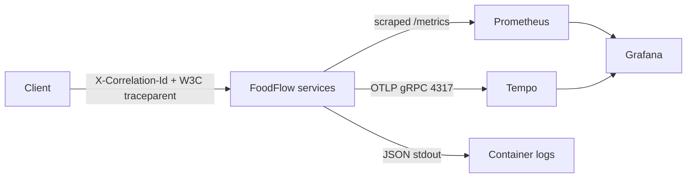
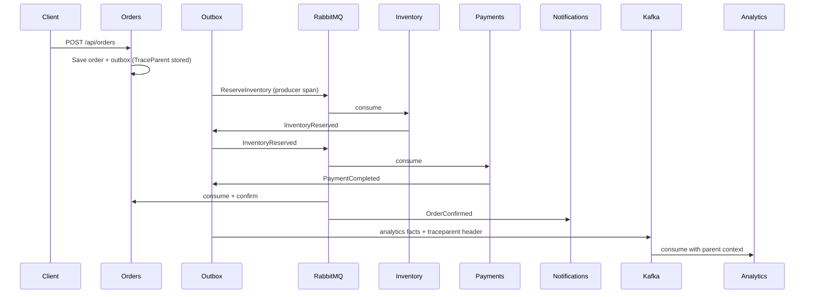

# Phase 3 — Production readiness and observability

Phase 1 and Phase 2 stay in place. This phase does not redesign the choreography. It makes the running platform observable, restartable, and automatically validated.

## 1. Observability architecture



Three signals, three backends:

| Signal | How it is produced | Where you look |
| --- | --- | --- |
| Traces | OpenTelemetry SDK, OTLP to Tempo | Grafana → Tempo, or Tempo search |
| Metrics | OpenTelemetry meters + ASP.NET/runtime, Prometheus exporter at `/metrics` | Prometheus UI, Grafana dashboard **FoodFlow overview** |
| Logs | `AddJsonConsole` with scopes (`CorrelationId`, `TraceId`, `SpanId`, `ServiceName`) | `docker compose logs` |

There is no fake tracing. Spans come from ASP.NET Core, Npgsql, MassTransit, the FoodFlow `ActivitySource`, the outbox publisher, and the Kafka analytics consumer.

## 2. OpenTelemetry

`FoodFlow.ServiceDefaults.AddFoodFlowOpenTelemetry` registers one resource per process (`service.name` = `foodflow-orders`, …).

Instrumentation:

- ASP.NET Core (HTTP server spans and metrics). `/health` and `/metrics` are filtered out of traces so scrapes do not flood Tempo.
- `HttpClient`
- Npgsql (`AddNpgsql`)
- MassTransit `ActivitySource` (built into MassTransit 8)
- Custom source/meter `FoodFlow`

Export:

- **Metrics** always: Prometheus scrape endpoint `/metrics` (`OpenTelemetry.Exporter.Prometheus.AspNetCore`).
- **Traces** when `OpenTelemetry:OtlpEndpoint` or `OTEL_EXPORTER_OTLP_ENDPOINT` is set. Compose sets `http://tempo:4317` (OTLP gRPC).

Without Tempo (local `dotnet run` without Compose observability), traces are not exported. Metrics still work.

## 3. Distributed tracing

A checkout is one **trace** (one `TraceId`) with many **spans** (`SpanId`):



The HTTP span ends when the API returns `201`. The outbox publisher runs later, so the W3C `traceparent` is stored on `outbox_messages.TraceParent` and restored before publish (`FoodFlowTelemetry.StartFromParent`). MassTransit then propagates that context on RabbitMQ. Kafka records get a `traceparent` header from `Activity.Current`.

| Term | Meaning in this repo |
| --- | --- |
| `Activity` | .NET's tracing primitive. `Activity.Current` is the span in this thread. |
| `TraceId` | Identifies the whole checkout. Same value across Orders → RabbitMQ → Inventory → Payments → Notifications, and Kafka → Analytics when headers are present. |
| `SpanId` | Identifies one operation inside that trace (HTTP request, outbox publish, consumer, SQL). |
| `traceparent` | W3C header: `00-{traceId}-{spanId}-{flags}`. |
| `CorrelationId` | Business/request id from `X-Correlation-Id`. Copied onto contracts. Used to join logs and events even if tracing is off. |

**Correlation ID vs distributed tracing:** Correlation ID is a string you invented (or the client sent) so humans and logs can say “this checkout”. Distributed tracing is a tree of timed spans with parent/child links, sampling, and a standard wire format. FoodFlow keeps both: `CorrelationId` on messages and logs; `TraceId`/`SpanId` on logs and Tempo.

## 4. Metrics

Meter name `FoodFlow`. Prometheus names replace `.` with `_` and add `_total` on counters.

| Instrument | Operational question |
| --- | --- |
| `orders.created` | Are checkouts being accepted? |
| `orders.confirmed` / `orders.cancelled` | Is the workflow finishing? |
| `inventory.reservations` / `inventory.reservation.failures` | Oversell vs empty stock |
| `payments.completed` / `payments.failed` | Fake provider decline rate |
| `notifications.sent` | Are customers being notified? |
| `event.processing.duration` | How long do outbox publishes, consumers, and Kafka applies take? |
| `consumer.failures` | Are handlers throwing after the retry policy? |

ASP.NET and runtime meters answer request rate, latency, and process CPU.

Permanent business outcomes (out of stock, declined card) increment the business counters. They do **not** increment `consumer.failures`, because those handlers complete successfully and publish failure events.

## 5. Prometheus

Compose service `prometheus` (port **9090**) scrapes each app at `/metrics` every 10s (`deploy/observability/prometheus.yml`). Retention is 6h / 256MB so a laptop is not filled.

Verify:

```bash
curl -sS http://localhost:5101/metrics | head
curl -sS 'http://localhost:9090/api/v1/query?query=orders_created_total'
```

Targets: Prometheus UI → Status → Targets. All six FoodFlow jobs should be **UP** after the apps are healthy.

## 6. Grafana

Compose service `grafana` (port **3000**). Local login `foodflow` / `foodflow`. Anonymous Viewer is enabled for demos.

Provisioned datasource: Prometheus + Tempo. Dashboard: **FoodFlow overview** (request rate, 5xx, p95, orders, inventory/payment failures, message processing, counters).

This is an operations board, not a design exercise. Empty HTTP panels mean the OTel Prometheus names differ from the dashboard PromQL; business counters still prove scrape works.

## 7. Logging

JSON console logs include UTC timestamps, log level, and scopes:

- `ServiceName`
- `CorrelationId`
- `TraceId`
- `SpanId`

Do not log passwords, tokens, connection strings, or card data. The fake payment gateway only stores amount, currency, and a short failure reason.

## 8. Health checks

Unchanged contract:

| Endpoint | Meaning |
| --- | --- |
| `/health/live` | Process is up. Only the `self` check. Orchestrators may restart on failure. |
| `/health/ready` | Dependencies required to take traffic. Database-backed services include EF Core. |

Compose `healthcheck` uses `/health/live` so a brief Postgres blip does not kill the container. Readiness is for you (and a future load balancer).

## 9. RabbitMQ observability

Management UI: http://localhost:15672 (`foodflow` / `foodflow`).

During an incident:

1. **Overview** — message rates, connections.
2. **Queues** — `reserve-inventory`, `inventory-reserved` (Payments), `payment-completed`, `payment-failed`, notification queues, and `*_error`.
3. **Consumers** — if a service is down, the queue has ready messages and zero consumers.
4. **Exchanges** — MassTransit fanout/topic topology.

Poison product `44444444-...` lands in `reserve-inventory_error`. That is inspectable here; it is not a business `InventoryReservationFailed` event.

If RabbitMQ is down, HTTP still commits the order + outbox. The publisher retries. Checkout is delayed, not lost.

## 10. Kafka observability

No extra Kafka UI (keeps RAM down). Use the broker CLI inside the container:

```bash
sg docker -c 'docker exec foodflow-kafka kafka-topics.sh --bootstrap-server 127.0.0.1:9092 --list'
sg docker -c 'docker exec foodflow-kafka kafka-consumer-groups.sh --bootstrap-server 127.0.0.1:9092 --group foodflow-analytics --describe'
```

| Concept | This demo |
| --- | --- |
| Topics | `foodflow.orders`, `foodflow.payments` |
| Key / partition | `OrderId` → same order stays ordered on one partition |
| Group | `foodflow-analytics` |
| Offset | Committed after the in-memory snapshot apply |
| Retention | 168 hours (`KAFKA_CFG_LOG_RETENTION_HOURS`) |
| Lag | `LAG` column from `--describe` |
| Replay | New group id, or reset offsets; Analytics projection is in-memory so a full rebuild needs consume-from-earliest |

If Kafka is down, checkout still completes on RabbitMQ. Kafka outbox rows retry. Analytics lags.

## 11. Resilience

| Pattern | Where | What it is not |
| --- | --- | --- |
| Timeout | Kafka produce `MessageTimeoutMs` / `RequestTimeoutMs`; host shutdown 30s | Infinite hang on broker death |
| Retry | MassTransit intervals 200/400/800 ms except `PermanentMessagingException`; outbox `AttemptCount`; Kafka consumer reconnect loop; startup migrate retry | Retrying a declined card or empty stock |
| Idempotency | Inbox + unique `Payment.OrderId` + reservation `OrderId` | Exactly-once across processes |
| Cancellation | `CancellationToken` through handlers and outbox | Ignoring SIGTERM |
| Circuit breaker | **Not** added on the operational path | Would hide outbox retry; Kafka/Rabbit outages are already isolated by the outbox |

There is no service-to-service HTTP, so there is no HTTP circuit breaker. A circuit breaker in front of `IPublishEndpoint` would fight the outbox.

## 12. Graceful shutdown

`HostOptions.ShutdownTimeout` is 30 seconds. `MassTransitHostOptions.StopTimeout` is 30 seconds with `WaitUntilStarted`.

On SIGTERM / `docker compose stop`:

1. Kestrel stops accepting new HTTP.
2. MassTransit stops the receive endpoints; in-flight consumes finish or the message is not acked and will redeliver (at-least-once).
3. Outbox processor sees `stoppingToken` and leaves unpublished rows for the next process.
4. Kafka analytics consumer `Close()`s, which commits/leaves the group cleanly; uncommitted records are consumed again.

No silent drop of a committed outbox row.

## 13. Docker

```bash
docker compose config
docker compose up --build -d
docker compose ps
```

Includes PostgreSQL × 5, RabbitMQ, Kafka (KRaft, heap capped), apps, Prometheus, Tempo, Grafana. Named volumes, one bridge network, `restart: unless-stopped`, healthchecks.

Local credentials `foodflow` / `foodflow` are **development defaults**, documented in [dev-environment.md](dev-environment.md). They are not production secrets.

## 14. CI/CD

`.github/workflows/ci.yml`: checkout, .NET from `global.json`, restore, Release build, test, `docker compose config`.

Every push/PR is compiled and tested. Full Compose E2E stays a local verification (Testcontainers already cover brokers in CI).

## 15. Security / configuration

- Connection strings and broker passwords live in environment / `appsettings.Development.json`, not in source as production secrets.
- App containers listen on `8080` internally; host ports 5101–5106, 9090, 3000, 3200, 15672 are for the laptop demo.
- JSON logs must not include the fake “card”. They do not.
- Grafana admin password is the same local default. Change it if you expose the port beyond localhost.

## 16. Testing

`dotnet test` includes domain tests plus Testcontainers workflows: happy path, inventory failure, payment compensation, duplicate reserve, transient retry, dead-letter, Kafka analytics, inventory restart, health/metrics, correlation header.

Compose E2E is the same scenarios against published ports plus Prometheus/Grafana/Tempo.

## Related documents

- [Interview guide](interview-guide.md)
- [ADR 007 — OpenTelemetry](adr/007-opentelemetry.md)
- [Phase 2 event flow](phase-2-event-driven.md)
